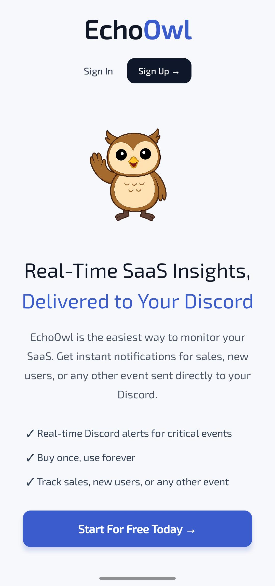
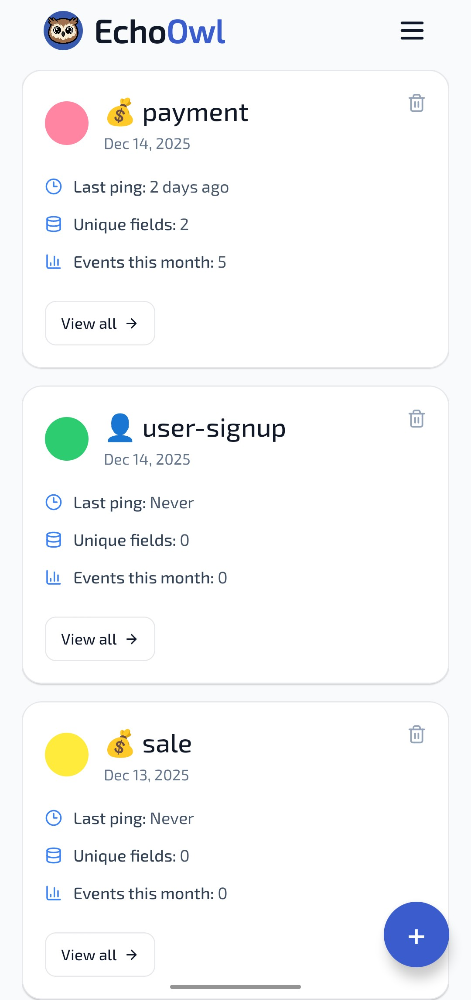
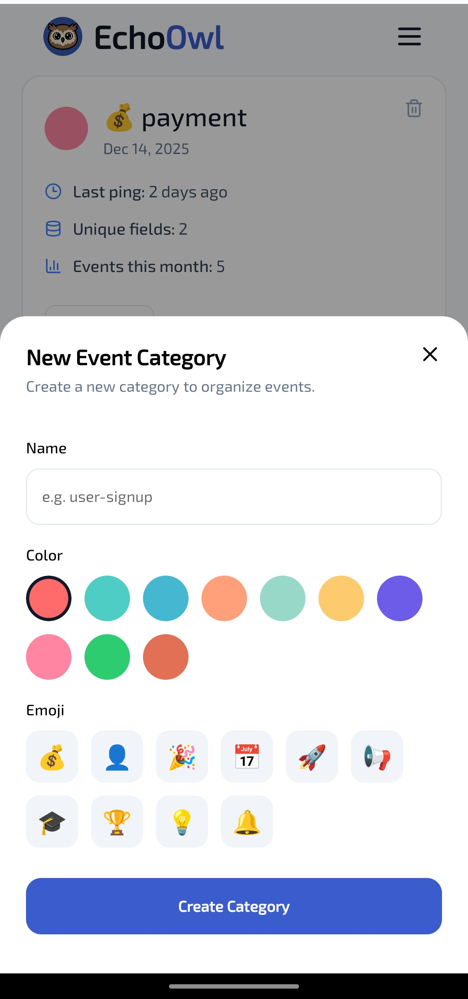
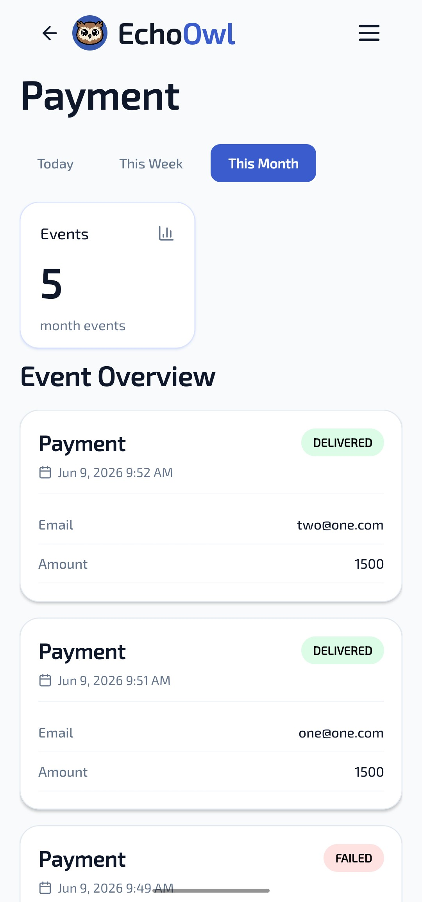
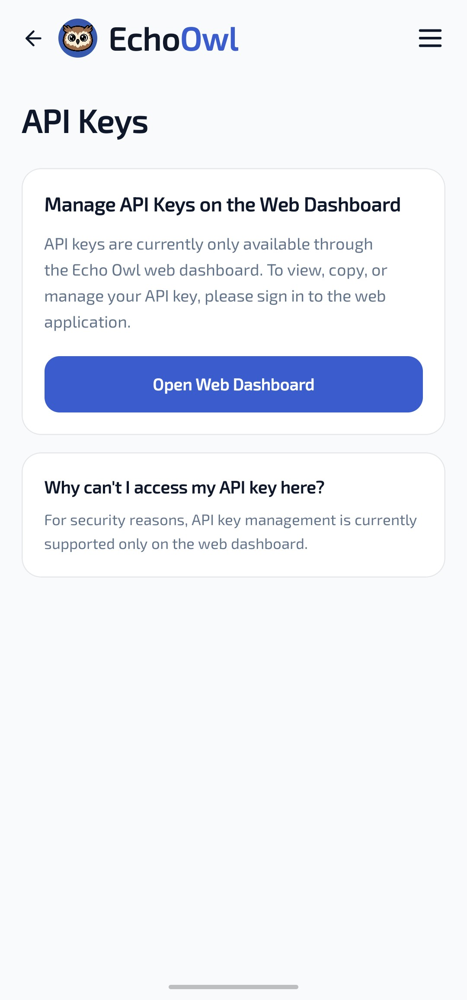
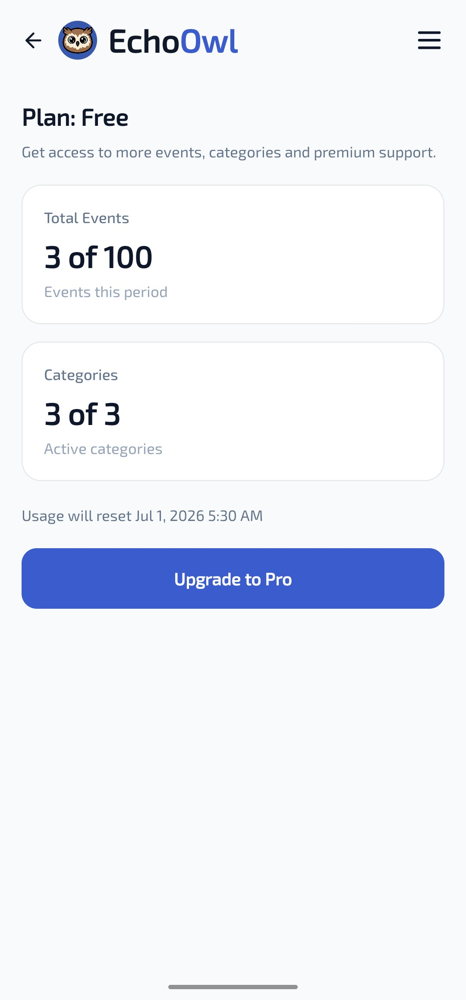
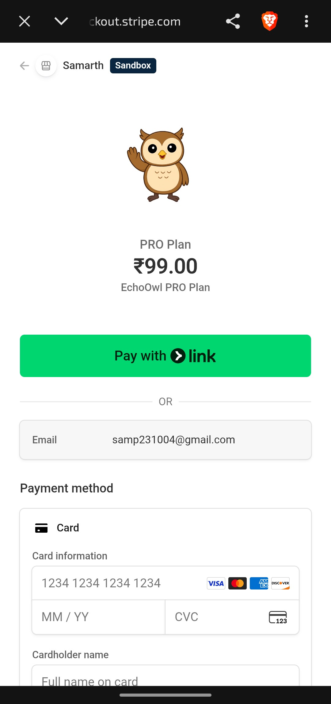
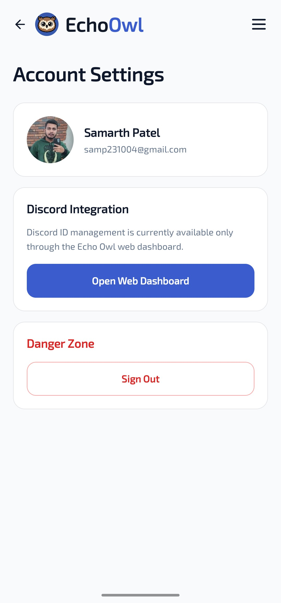

# 🦉 EchoOwl Mobile

EchoOwl Mobile is the React Native + Expo version of EchoOwl, a SaaS event monitoring platform for tracking product events, organizing event categories, and receiving alerts through the EchoOwl backend.

This app is built for Android and iOS with Expo Router, Clerk authentication, React Query, Zustand, and a Spring Boot REST API.

> 📘 Migration notes: see [MIGRATION.md](./MIGRATION.md) for the full Next.js → React Native + Expo migration guide.

## ✨ Highlights

| Area | What EchoOwl Mobile Supports |
|---|---|
| 🔐 Authentication | Clerk sign in, sign up, email verification, and session handling |
| 📊 Dashboard | View event categories, usage, category stats, and recent activity |
| 🧩 Categories | Create and inspect event categories with mobile-first screens |
| 🔑 API Keys | View API key settings screen; editing/viewing sensitive keys currently uses the web version |
| 💳 Billing | Mobile upgrade flow with Stripe checkout integration |
| ⚙️ Account | Account settings, sign out, plan information, and usage limits |
| 📱 Distribution | Standalone Android APK through Expo EAS Build |

## ⚠️ Current Mobile Limitation

The mobile app currently does **not** allow editing or viewing the API key or Discord key directly. Please use the EchoOwl web version for API key and Discord key management.

## 🛠️ Tech Stack

| Category | Technology |
|---|---|
| Mobile Framework | React Native, Expo |
| Routing | Expo Router |
| Language | TypeScript |
| Auth | Clerk Expo SDK |
| Data Fetching | TanStack React Query |
| State | Zustand |
| HTTP Client | Axios |
| Forms & Validation | React Hook Form, Zod |
| Storage | Expo Secure Store |
| Payments | Stripe checkout through backend API |
| Backend | Spring Boot REST API |
| Icons | Lucide React Native |

## 🚀 Quick Start

### Prerequisites

- Node.js 18+
- npm or pnpm
- Expo CLI / EAS CLI
- Android Studio for emulator builds, or a physical Android device
- A Clerk publishable key
- A running EchoOwl backend API

### Install

```bash
npm install
```

### Environment

Create `.env` in the project root:

```env
EXPO_PUBLIC_CLERK_PUBLISHABLE_KEY=pk_test_...
EXPO_PUBLIC_API_URL=https://your-backend-url.com
```

For EAS builds, the same values must be present in `eas.json` or configured through EAS environment variables.

### Run Locally

```bash
npm start
```

Useful commands:

```bash
npm run android
npm run ios
npm run web
npm run typecheck
npm run lint
```

## 📦 Android APK Build

Build a preview APK:

```bash
eas build --platform android --profile preview
```

Expo stores the Android signing keystore in the cloud for this project. Keep using the same Expo account for future builds so users can install updates over older APKs.

## 🔌 API Integration

The app talks to the EchoOwl Spring Boot backend using REST endpoints.

| Feature | Endpoint |
|---|---|
| Auth sync | `GET /api/auth/getDatabaseSyncStatus` |
| Categories | `GET /api/category/getEventCategories` |
| Create category | `POST /api/category/createEventCategory` |
| Delete category | `POST /api/category/deleteCategory` |
| Category events | `GET /api/category/getEventsByCategoryName` |
| Plan | `GET /api/payment/getUserPlan` |
| Checkout | `POST /api/payment/createMobileCheckoutSession` |
| Usage | `GET /api/project/getUsage` |
| Discord ID | `POST /api/project/setDiscordID` |

## 📁 Project Structure

```text
.
├── app/                         # Expo Router routes
│   ├── (auth)/                  # Sign in, sign up, verification
│   ├── (landing)/               # Mobile landing screen
│   ├── (app)/(tabs)/            # Protected dashboard/settings tabs
│   ├── _layout.tsx              # Root app layout
│   └── index.tsx                # Auth-aware entry route
├── assets/                      # App icons, splash, brand assets
├── ScreenShots/                 # README screenshots
├── src/
│   ├── components/              # Reusable React Native UI
│   ├── hooks/                   # API hooks
│   ├── lib/                     # API client, providers, dates
│   ├── store/                   # Zustand stores
│   ├── types/                   # Shared TypeScript types
│   └── utils/                   # Utility exports
├── app.json                     # Expo config
├── eas.json                     # EAS build profiles
├── package.json
└── tsconfig.json
```

## 🧪 Quality Checks

```bash
npm run typecheck
npm run lint
```

## 🧯 Troubleshooting

| Problem | What to Check |
|---|---|
| APK closes immediately | Verify `EXPO_PUBLIC_CLERK_PUBLISHABLE_KEY` and `EXPO_PUBLIC_API_URL` are present in the EAS build profile |
| API calls fail on phone | Do not use `localhost`; use a deployed backend URL or reachable LAN IP |
| Clerk auth fails | Confirm the publishable key and Clerk dashboard settings |
| Old icon still appears | Uninstall the old APK or clear launcher cache, then install a fresh EAS build |
| Build fails | Run `npm run typecheck`, check `app.json`, then rebuild with EAS |

## 📚 Documentation

- [Migration Guide](./MIGRATION.md)
- [Expo Documentation](https://docs.expo.dev)
- [Expo Router](https://docs.expo.dev/routing/introduction)
- [EAS Build](https://docs.expo.dev/build/introduction)
- [Clerk Expo SDK](https://clerk.com/docs/references/expo/overview)
- [TanStack Query](https://tanstack.com/query/latest)
- [Zustand](https://github.com/pmndrs/zustand)

## 📸 App Screenshots

<div align="center">
  <table>
    <tr>
      <td align="center" width="25%">
        
        <br />
        <sub>Landing Page</sub>
      </td>
      <td align="center" width="25%">
        
        <br />
        <sub>Dashboard</sub>
      </td>
      <td align="center" width="25%">
        
        <br />
        <sub>Create Category</sub>
      </td>
      <td align="center" width="25%">
        
        <br />
        <sub>Category Detail</sub>
      </td>
    </tr>
    <tr>
      <td align="center" width="25%">
        
        <br />
        <sub>API Key Setting</sub>
      </td>
      <td align="center" width="25%">
        
        <br />
        <sub>Upgrade Page</sub>
      </td>
      <td align="center" width="25%">
        
        <br />
        <sub>Stripe Payment</sub>
      </td>
      <td align="center" width="25%">
        
        <br />
        <sub>Account Settings</sub>
      </td>
    </tr>
  </table>
</div>

## 👨‍💻 About Author

Full-Stack Software Developer with strong experience building scalable SaaS applications and enterprise-grade backend systems using Java, Spring Boot, React.js, Next.js, Node.js, MongoDB, React Native, and AWS. Proven ability to design secure payment systems, implement real-time and AI-powered features, and deliver production-grade web and mobile platforms. Proficient in REST API development, Spring Security, CI/CD pipelines, React Native & Expo mobile development, and cloud-native deployments. Active open-source contributor with multiple merged pull requests across community projects and a track record of delivering high-impact solutions in real-world environments.

| Link | URL |
|---|---|
| 🌐 Portfolio | <https://samp231004.github.io/Portfolio/> |
| 🐙 GitHub | <https://github.com/SamP231004> |
| 💼 LinkedIn | <https://www.linkedin.com/in/samp231004/> |